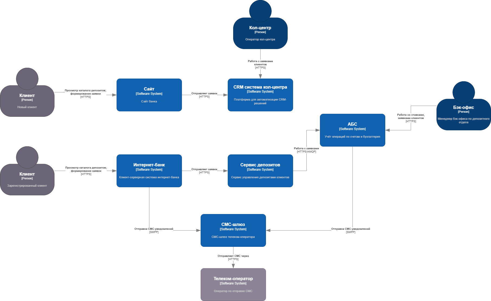
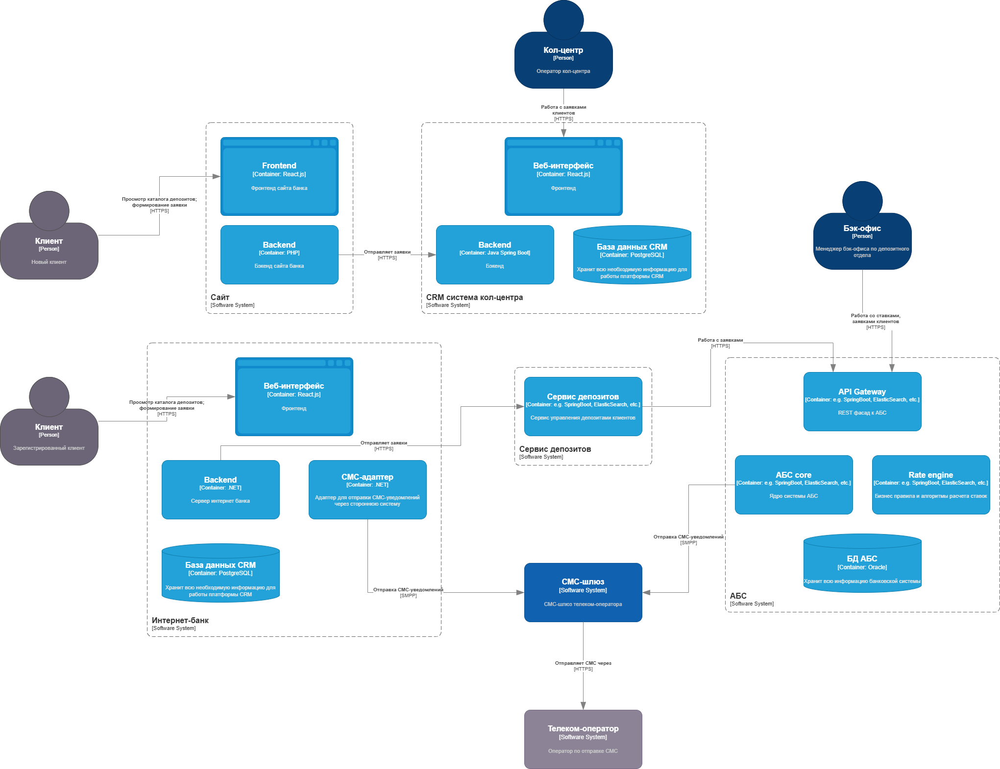

# ADR - Архитектурное решение

### **Название задачи:** 
### **Автор: Машин Иван**
### **Дата: 18.07.2025**
### **Функциональные требования**

| **№** | **Действующие лица или системы**         | **Use Case**                                     | **Описание**                                                                                                              |
|:-----:|:-----------------------------------------|:-------------------------------------------------|:--------------------------------------------------------------------------------------------------------------------------|
|  UC1  | Новый клиент, сайт                       | Просмотр каталога депозитов                      | Пользователь открывает публичную страницу с перечнем депозитных продуктов и базовыми ставками.                            |
|  UC2  | Новый клиент, сайт, система кол-центра   | Подача заявки                                    | Клиент вводит ФИО + телефон; фронтенд приложение отправляет заявку в CRM кол-центра.                                      |
|  UC3  | Зарегистрированный клиент, интернет-банк | Просмотр персонализированного каталога депозитов | Клиент открывает персонализированный каталог депозитных продуктов и может видеть персонализированные ставки.              |
|  UC4  | Зарегистрированный клиент, интернет-банк | Создание заявки                                  | Клиент выбирает счёт, сумму и срок; подтверждает СМС-OTP; фронтенд приложение создаёт заявку через сервис интернет-банка. |
|  UC5  | Менеджер бэк‑офиса депозитов, АБС        | Согласование ставки                              | В АБС просматривает заявку, корректирует и подтверждает ставку.                                                           |
|  UC6  | ABS, СМС-шлюз, клиент                    | Уведомление о ставке                             | После подтверждения ставки АБС инициирует СМС с предложением.                                                             |
|  UC7  | Менеджер бэк‑офиса депозитов, АБС        | Открытие депозита                                | При одобрении клиентом менеджер создаёт договор в АБС; система отправляет финальное SMS.                                  |

### **Нефункциональные требования**

| **№** | **Требование**                                                                                         |
|:-----:|:-------------------------------------------------------------------------------------------------------|
| NFR1  | Доступность всех сервисов системы (сайт, интернет-банк, СМС-шлюз) - 99.9%, режим 24/7                  |
| NFR2  | Время отклика любой операции клиента < 300 мс                                                          |
| NFR3  | Скорость доставки исходящего СМС-сообщения < 1мин                                                      |
| NFR4  | Использование TLS 1.2+ для сайта и интернет-банка                                                      |
| NFR5  | Поддержка горизонтального масштабирования интернет-банка; равномерное распределение нагрузки между ЦОД |
| NFR6  | Обработка пиковых заявок без деградации SLA (< 300 мс)                                                 |
| NFR7  | Минимизация нагрузки на БД АБС                                                                         |

### **Решение**

#### Диаграмма контекста C4

#### Диаграмма контейнеров C4

### **Альтернативы**

Опишите здесь наиболее важные альтернативные решения.

| Вариант                                        | Почему отказались                                                                             |
|------------------------------------------------|-----------------------------------------------------------------------------------------------|
| 1. Прямой доступ IB -> Oracle АБС (как сейчас) | Нарушает NFR5: риск перегрузки и отсутствие изоляции; сложно масштабировать, нет кэширования. |
| 2. Реализация ставок в отдельной MySQL‑БД      | Ввод ещё одного стека, нет экспертизы; дублирование данных, проблемы консистентности.         |

**Недостатки, ограничения, риски**

* Нагрузка на АБС API Gateway: при росте объёма заявок понадобится горизонтальное масштабирование + rate-limit.
* Сложность DevOps: Интернет-банк по-прежнему монолит; кусок микросервисов увеличит нагрузку на CI/CD и monitoring.
* Вендор-лок СМС-платформы: бизнес-правила OTP и уведомлений вынесены, но канал остаётся монолитом подрядчика.
* Резервный ЦОД: пока переключение ручное - риск превышения RTO (нужно планировать автоматизацию).
