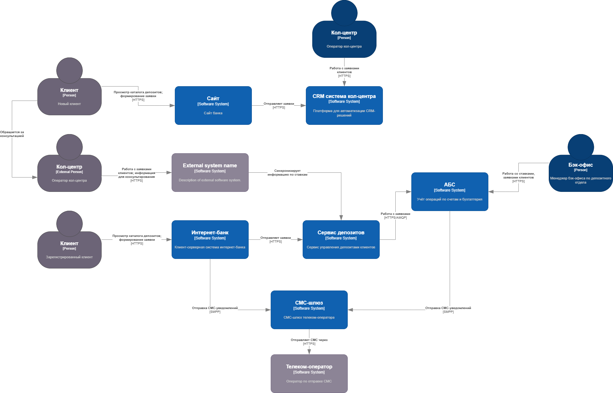
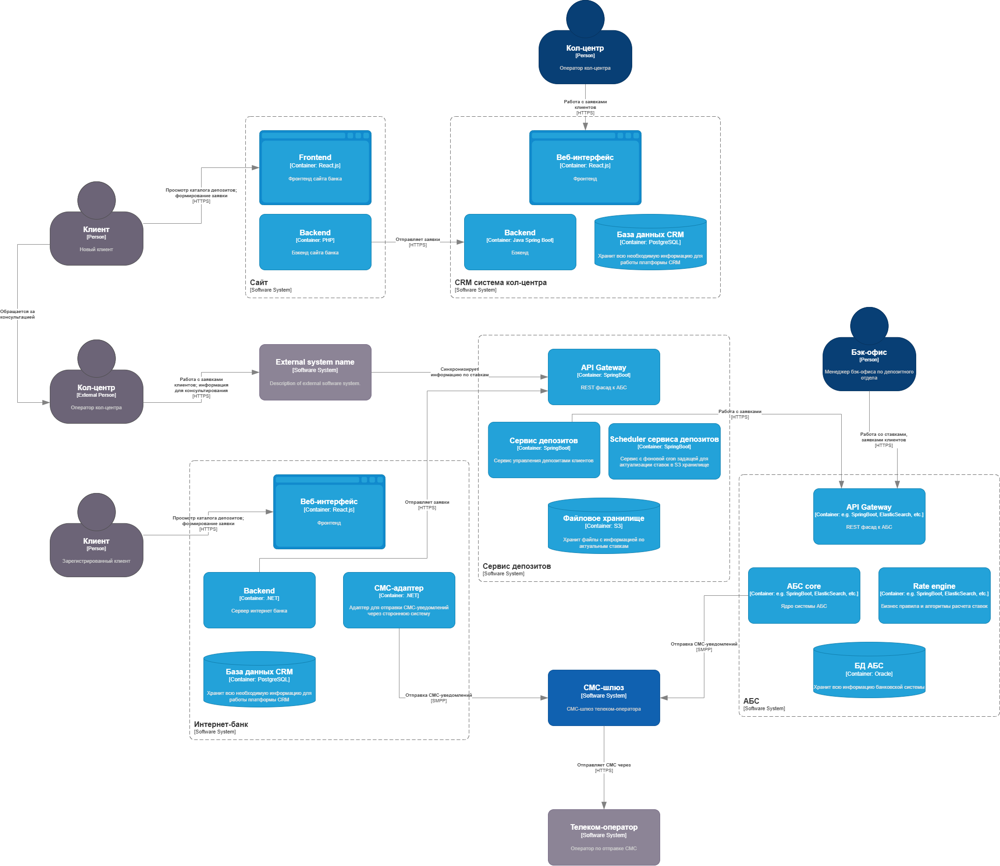

# ADR - Архитектурное решение

### **Название задачи:** 
### **Автор: Машин Иван**
### **Дата: 18.07.2025**
### **Функциональные требования**

| **№** | **Действующие лица или системы** | **Use Case**                    | **Описание**                                                                                                     |
|:-----:|:---------------------------------|:--------------------------------|:-----------------------------------------------------------------------------------------------------------------|
|  UC1  | Оператор внутреннего кол-центра  | Просмотр актуальной ставки      | В карточке обращения оператор нажимает «Узнать ставку» -> CRM вызывает Rate API, отображает базовую/спец-ставку. |
|  UC2  | Deposit Service, CRM кол-центра  | Получение ставки                | CRM делает RPC-запрос получения ставки; сервис отдаёт информацию о базовой ставке и спец-ставках (если есть).    |
|  UC3  | Scheduler Deposit Service        | Экспорт файла ставок партнёру   | 1 раз в день в 02:00 MSK сервис формирует csv файл и кладёт в защищённое хранилище.                              |
| AUC3  | DevOps / Monitoring              | Оповещение о просрочке экспорта | Если файл не сгенерирован до 02:30, система алертов шлёт уведомление в корпоративный мессенджер и СМС.           |
|  UC4  | Партнёрский кол-центр            | Импорт файла ставок             | Скрипт партнёра по расписанию скачивает csv файл по предоставленной ссылке и загружает в свою систему.           |
|  UC5  | Бэк-офис депозитов, АБС          | Обновление ставок               | Менеджеры загружают Excel, сервс АБС Rate Engine пересчитывает значения; сервис синхронизирует набор ставок.     |

### **Нефункциональные требования**

| **№** | **Требование**                                                                        |
|:-----:|:--------------------------------------------------------------------------------------|
| NFR1  | Доступность всех сервисов системы (сайт, интернет-банк, СМС-шлюз) - 99.9%, режим 24/7 |
| NFR2  | Файл ставок генерируется ежедневно до 02:30 МСК.                                      |
| NFR3  | Формат csv: `deposit_code,term_months,base_rate,VIP_rate_min,VIP_rate_max`.           |
| NFR4  | Передача файла по HTTPS.                                                              |

### **Решение**

#### Диаграмма контекста C4

#### Диаграмма контейнеров C4

### **Альтернативы**

| Вариант                              | Причина отказа                                                              |
|--------------------------------------|-----------------------------------------------------------------------------|
| FTP/SFTP-сервер для загрузки файлов  | Требует поднятия новой инфраструктуры, нарушает полику безопасности (NFR4). |
| Рассылка ставок по email             | Нет гарантии доставки, риск спама-фильтров, нет автоматизации импорта.      |
| Собственный веб-сервис для партнёров | Партнёр не готов пользоваться API.                                          |

**Недостатки, ограничения, риски**

* Ограничение 24 ч на ссылку: если партнёр пропустил окно, необходимо ручное восстановление.
* S3 зависимость: требуемая доступность 99.9% все равно имеет возможность при глобальном сбое партнёр получить ошибку отправки файла.

### 3.2 Диаграмма контейнеров (C4-Level 2)

*Файл*: **cc-rates-containers.png**

| №         | Контейнер                   | Система (владелец) | Технологии / окружение        | Назначение                                      | Данные                  | HA                             |
|-----------|-----------------------------|--------------------|-------------------------------|-------------------------------------------------|-------------------------|--------------------------------|
| **C4-R1** | **Rate API**                | Deposit Service    | ASP.NET Minimal API           | Отдаёт JSON со ставками по запросу CRM          | MS SQL (view `rates_v`) | 2 pods / ЦОД                   |
| **C4-R2** | **Rate Exporter Job**       | Deposit Service    | .NET Worker Service + AWS SDK | Генерирует CSV и грузит в S3; планировщик cron. | MS SQL                  | Kubernetes CronJob, retries ×3 |
| **C9-R3** | **CRM Rates Client**        | CRM Contact Center | Spring Boot module            | Обёртка над REST Rate API; кэш 10 мин.          | Redis in-cluster        | Scale with CRM pods            |
| **EXT1**  | **S3 Bucket partner-rates** | Облако банка       | AWS S3 (SSE-KMS)              | Хранит последние 3 файла CSV                    | Object Storage          | 11 × 9 durability              |
| **EXT2**  | **Partner CC Script**       | Партнёр            | bash/python                   | Скачивает CSV, импортирует в их CRM             | локально                | —                              |

> Остальные контейнеры остаются без изменений; Rate API и Exporter добавлены в Deposit Service (см. границу).
> Route 53 + CloudFront выдают pre-signed URL партнёру; доступ по IP-allow-list.

### 3.3 Логика выбора технологий

## 5. Список ключевых задач (Epic → Features)

| Система                                | Крупная задача                            | Под-шаги / заметки               |
|----------------------------------------|-------------------------------------------|----------------------------------|
| **Deposit Service**                    | **DS-45** Добавить Rate API               |                                  |
|                                        |                                           | • Создать view `rates_v` + DTO   |
| • Реализовать endpoint `/rates/{code}` |                                           |                                  |
| • Unit/Integration tests, OpenAPI spec |                                           |                                  |
|                                        | **DS-46** Cron-экспорт CSV                |                                  |
|                                        |                                           | • Worker service + cron schedule |
| • Генерация CSV, выгрузка в S3         |                                           |                                  |
| • Slack алерты через Webhook           |                                           |                                  |
| **CRM Contact Center**                 | **CRM-32** Модуль запросов ставок         |                                  |
|                                        |                                           | • REST client, UI widget         |
| • Redis LRU cache                      |                                           |                                  |
| • E2E tests                            |                                           |                                  |
| **Platform/Infra**                     | **INF-18** Создать S3-bucket + IAM policy | Lifecycle policy: keep 3 files   |
| **Partner CC**                         | **PCC-7** Импорт скрипт                   | Bash/python + cron daily         |

---

## 6. Road Map (6 месяцев → 12 месяцев)

*Диаграмма*: **roadmap-rates.drawio / roadmap-rates.png**

* **Месяц 1**

  * DS-45 backend
  * INF-18 bucket & IAM
* **Месяц 2**

  * DS-46 exporter job (Dev)
  * CRM-32 client (Dev)
* **Месяц 3**

  * QA, UAT, нагрузочные тесты Rate API
* **Месяц 4**

  * Release Rate API + CRM widget
  * Begin partner integration PCC-7
* **Месяц 5**

  * Pilot файл-обмена, мониторинг SLA
* **Месяц 6**

  * GA для партнёрского CC, ретроспектива, backlog enhancement
* **Горизонт 12 мес.**

  * Event-stream Kafka instead of daily file
  * Рефактор CRM cache to realtime push

> Детализированная диаграмма включена в draw\.io файл; верх-линейка Q2/Q3 разбита по системам аналогично примеру менеджера.
